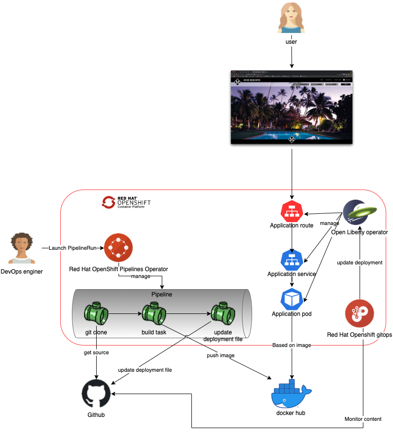

# Deploy a Liberty application with CICD toolchains



* Option A: [CI/CD with tekton](./doc/cicd-tekton.md)
* Option B(represented by the diagram above): [CI with Tekton and CD with ArgoCD](./doc/cicd-tekton-argocd.md)

## Supporting application

The java web application that is used to support the demonstration is the Application Modernisation Resorts. You could find the original application at this [github repository](https://github.com/ibm/appmod-resorts).

## Prepare 

Clone the git repo on your laptop. 
``` 
git clone git@github.com:jtarte/liberty_tekton_sample.git
```

All the commands that are given in this sample demo suppose that you are inside the cloned repository. Move into the cloned repository.
```
cd liberty_tekton_sample.git
```

Create the namespace that will be used for the demo
```
oc new-project liberty
```

Before to start the deployment of the demo, you may have to prepare your environment. You could find instructions on this [page](./doc/prereq.md)

## Choice your deploiement methods

The demo provides two way to deploy the Liberty application.

The first is based only on tekton pipelines. The CI and the CD are done inside the same pipeline via Tekton tasks. The instruction are [here](./doc/cicd-tekton.md)

The second is based on tekton and argocd. The CI is delivered by tekton pipeline. The CD ensures the deployment of the application by leveraging gitops approach. The gitops operation are done by argocd.The instruction are [here](./doc/cicd-tekton-argocd.md)

Tekton is delivered by Red Hat OpenShift Pipelines.

ArgoCD is delivered by Red Hat OpenShift Gitops. 

## Reference 

* [First tasks with Tekton on IBM Cloud Pak for Applications](https://medium.com/@jerome_tarte/first-tasks-with-tekton-on-ibm-cloud-pak-for-application-88c8f496723d)
* [First pipeline with Tekton on IBM Cloud Pak for Applications](https://medium.com/@jerome_tarte/first-pipeline-with-tekton-on-ibm-cloud-pak-for-application-e82ea7b8a6b1)
* [Additional Tekton tips for your pipelines](https://medium.com/@jerome_tarte/additional-tekton-tips-for-your-pipelines-7dd662140e8f)
* [Application Modernisation repository](https://github.com/ibm/appmod-resorts)
