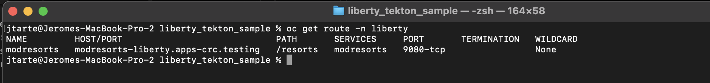

# CI/CD with Tekton and ArgodCD


## Prepare

All the steps that are described on the [main page](../README.md) and [prerequisites page](./prereq.md) should have be done before to start. 

## Create the Git update task

The pipepline generates a new docker image based on the source found in the git repository and update the application deployment file with the new version. The update of the page is detected by ArgoCD that deploys the new version of the application. 

To update the git content, the demo used a custom `Task` that changes the [kube/application.yaml file](../kube/application.yaml) by updating the version and the image fields. 

The custom task is defined [here](../tekton/git-update-task.yaml)
```
apiVersion: tekton.dev/v1beta1
kind: Task
metadata:
  name: git-update
spec:
  workspaces:
    - name: source
  params:
    - name: revision
      description: "branch of the git to be updated" 
      type: string
    - name: tag
      description: "the verison of the image that will be replace on the git file"
      type: string
    - name: dep_file
      description: "the name of the deployment file to be updated"
      type: string
  steps:
   - name: push-changes-gitops
     image: alpine/git:v2.26.2
     workingDir: $(workspaces.source.path)
     script: |
        #!/bin/sh
        set -e
        git config --global user.email "jerome.tarte@fr.ibm.com"
        git config --global user.name "tekton"
        
        sed -i "s/2.1/$(params.tag)/g" "$(params.dep_file)"
        cat ./kube/application.yaml 
        
        git add -u
        git commit -m "[tekton] updating deployment"
        git push origin HEAD:$(params.revision)
```

The task prepares the operation with git by setting the config. Then it changes the version and image tag with the new value using a sed command. And finally, it pushes the updated file to git. The authentication with Github is handled by the service account that runs the pipeline. 

Deploy this task on OpenShift.
```
oc apply -f ../tekton/git-update-task.yaml
```

## Review the pipeline

The pipeline is similar to the CICD done with tekton except the last task. It includes a `git-clone` cluster task and `buildah` cluster task. These two steps get the application source, then build the liberty application and push it to the target registry (docker in my case).

The last step is replaced by the `git-update` task. It updates the application deployment file with the version of the new generated image. 

The pipeline could be found [here](../tekton/liberty-build-gitops-pipeline.yaml).
``` 
apiVersion: tekton.dev/v1beta1
kind: Pipeline
metadata:
  name: liberty-build-gitops
spec:
  workspaces:
    - name: workspace
  params:
    - name: git_url
      description: "Git url"
    - name: branch
      description: "Revision to use"
    - name: image
      description: "the image name manipulated by this pipeline"
    - name: tag
      description: "the verison of the image"
    - name: dep_file
      description: "the name of the deployment file to be updated"
      default: ./kube/application.yaml
      type: string
  tasks:
    - name: checkout
      taskRef:
        name: git-clone
        kind: ClusterTask
      params:
        - name: url
          value: $(params.git_url)
        - name: revision
          value: $(params.branch)
        - name: deleteExisting
          value: 'true'
      workspaces:
        - name: output
          workspace: workspace
    - name: build
      runAfter:
        - checkout
      taskRef:
        name: buildah
        kind: ClusterTask
      params:
        - name: IMAGE
          value: $(params.image):$(params.tag)
      workspaces:
       - name: source
         workspace: workspace
    - name: git-update
      runAfter:
        - build
      taskRef:
        name: git-update
        kind: Task
      workspaces:
        - name: source
          workspace: workspace
      params:
        - name: revision
          value: $(params.branch)
        - name: tag 
          value: $(params.tag)
        - name: dep_file
          value: $(params.dep_file)
```

Deploy the pipeline on OpenShift.
``` 
oc apply -f ./tekton/liberty-build-gitops-pipeline.yaml -n liberty
```

## Initial deployment of the application 

The initial deployment of the application, in context of the demo, is done manually. For that , you have to apply the argocd application. The deployment file could find [here](../gitops/application.yaml).
```
apiVersion: argoproj.io/v1alpha1
kind: Application
metadata:
  name: liberty-modresorts
  namespace: openshift-gitops
  finalizers:
    - resources-finalizer.argocd.argoproj.io
spec:
  destination:
    namespace: liberty
    server: https://kubernetes.default.svc
  project: default
  source:
    path: kube
    repoURL: https://github.com/jtarte/liberty_tekton_sample
    targetRevision: main
  syncPolicy:
    automated:
      prune: true
      selfHeal: true
```

To deploy the application, use the command:
```
oc apply -f ./gitops/application.yaml -n openshift-gitops
```

Another option could be to used the `liberty-build-deploy-pipeline pipeline`, decribed [here](./cicd-tekton.md). But instead to deploy the application directly, you could change the script, defined in the `PipelineRun`,  to use the  `./gitops/application.yaml` script. 

The both options define the application into gitops. 

On the Argocd interface, you could see the result of your deployement. 


Get the route to access the application.
```
 oc get route -n liberty
```


You could use the route into a browser to access the application


You could also check the version that have been deployed.
```
oc get openlibertyapplication modresorts -n liberty -o yaml
````


As you could see the application is deployed with version 2.1 .

## Excute the pipeline

In real world, a change in the source code in the git should be detected and trigger the pipeline execution. But to simplify the demo, the pipeline will be started manually. 

It is done by creating an instance of pipelinerun. The template of the pipelinerun could be found [here](../tekton/liberty-build-gitops-pr.yaml)
```
apiVersion: tekton.dev/v1beta1
kind: PipelineRun
metadata:
  generateName: liberty-build-gitops-pr-
  namespace: liberty
  labels:
    tekton.dev/pipeline: liberty-build-deploy
spec:
  pipelineRef:
    name: liberty-build-gitops
  serviceAccountName: liberty-pipeline
  params: 
    - name: git_url
      value: https://github.com/jtarte/liberty_tekton_sample
    - name: branch
      value: main
    - name: image
      value: docker.io/jtarte/app-modresort
    - name: tag
      value: "2.2"
  workspaces:
    - name: workspace 
      volumeClaimTemplate:
        spec:
          accessModes:
            - ReadWriteOnce # access mode may affect how you can use this volume in parallel tasks
          resources:
            requests:
              storage: 1Gi
```
The important element in the file is `tag` value that will change the version of the application (and the associated iamge) to 2.2.

To execute the pipeline, use the following command:
```
oc create -f ./tekton/liberty-build-gitops-pr.yaml -n liberty
```

you could monitor the pipeline exuction with the command:
```
oc get pipelinerun -n liberty
``` 

After some minutes, the execution of the pipeline is finished 


As the pipeline updated the application deployment file (with the version 2.2), there is a desynchronisation between the git content and the content deployed on OpenShift. Argocd should detect this state and will enforce the deployment of the new version.

After some minutes, you could check the status of the application. 


You could see the application version and image have been updated to 2.2. And the application is still active.

## Conclusion

This demo shows hows tekton (Red hat pipelines) and ArgoCD (Red Hat Gitops) could be used to setup a CI/CD toolchain to deploy a liberty application. 
