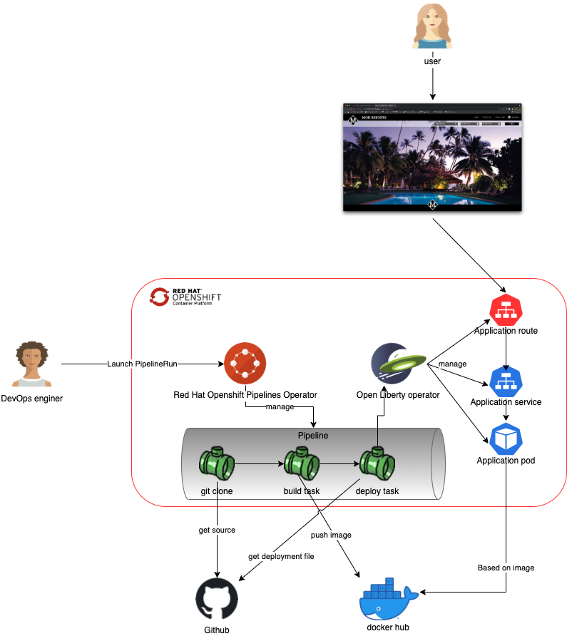
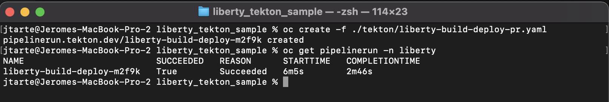
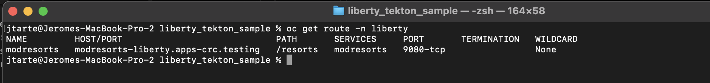

# CI/CD with Tekton



## Prepare

All the steps that are described on the [main page](../README.md) and [prerequisites page](./prereq.md) should have be done before to start. 

## Review the pipeline

All the tasks that are included in the pipelines are provided by the platform as `ClusterTask`. 

The pipeline uses:

* `git-clone`. It clones the git repository into the pipeline workspace. 
* `buildah.` It builds the application, constructs adocker image with the application and pushes it on the target registry.
* `oc-client`. It execute the deployement file to ensure the deployment of the application. 

The pipeline use the cluster task and provide to them the workspace and params that are need for the execution.

The pipeline loolks [like](../tekton/liberty-build-deploy-pipeline.yaml) :
```
apiVersion: tekton.dev/v1beta1
kind: Pipeline
metadata:
  name: liberty-build-deploy
spec:
  workspaces:
    - name: workspace
  params:
    - name: script 
      description: "the yaml script used to deploy the application"
      type: string
    - name: git_url
      description: Git url
    - name: branch
      description: Revision to use
    - name: image
    - name: tag
  tasks:
    - name: checkout
      taskRef:
        name: git-clone
        kind: ClusterTask
      params:
        - name: url
          value: $(params.git_url)
        - name: revision
          value: $(params.branch)
        - name: deleteExisting
          value: 'true'
      workspaces:
        - name: output
          workspace: workspace
    - name: build
      runAfter:
        - checkout
      taskRef:
        name: buildah
        kind: ClusterTask
      params:
        - name: IMAGE
          value: $(params.image):$(params.tag)
      workspaces:
       - name: source
         workspace: workspace
    - name: deploy
      taskRef:
        name: openshift-client
        kind: ClusterTask
      workspaces:
        - name: manifest-dir
          workspace: workspace
      runAfter:
        - build
      params:
        - name: SCRIPT
          value: $(params.script)   
```

## Excute the pipeline

In real world, a change in the source code in the git should be detected and trigger the pipeline execution. But to simplify the demo, the pipeline will be started manually. 

It is done by creating an instance of pipelinerun. The template of the pipelinerun could be found [here](../tekton/liberty-build-deploy-pr.yaml)
```
apiVersion: tekton.dev/v1beta1
kind: PipelineRun
metadata:
  generateName: liberty-build-deploy-
  namespace: liberty
  labels:
    tekton.dev/pipeline: liberty-build-deploy
spec:
  pipelineRef:
    name: liberty-build-deploy
  serviceAccountName: liberty-pipeline
  params:
    - name: script
      value: oc apply -f ./kube/application.yaml
    - name: git_url
      value: https://github.com/jtarte/liberty_tekton_sample
    - name: branch
      value: main
    - name: image
      value: docker.io/jtarte/app-modresort
    - name: tag
      value: "2.1"
  workspaces:
    - name: workspace 
      volumeClaimTemplate:
        spec:
          accessModes:
            - ReadWriteOnce # access mode may affect how you can use this volume in parallel tasks
          resources:
            requests:
              storage: 1Gi
```

The `PipelineRun` resource defiens the execution paramters like:

* The git repository where the application source are located.
* The name of the target image.
* The tag of the image. It is the version of te application.
* The script used for the application deployment (yaml of `Deployment`).
* The workspace. a pv that is used to store inforamtion between task. 

To launch the execution of the pipeline, use the following command:
```
oc create ./tekton/liberty-build-deploy-pr.yaml
```

Wait the end of th epipeline excution:
```
oc get pipelinerun -n liberty
```


Once it is completed with a success status, get the route to access the application.
```
 oc get route -n liberty
```


You could use the route into a browser to access the application


## Conclusion

This demo shows hows tekton (Red hat pipelines) could be used to setup a CI/CD toolchain to deploy a liberty application. 
