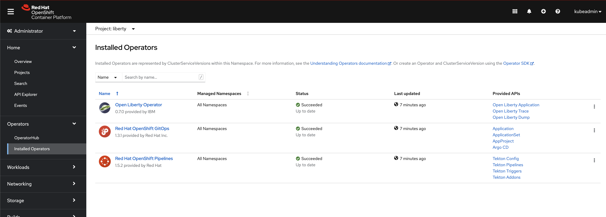

# Prereqisites

An OpenShift cluster is needed to run the demonstration. The tests were made on a OCP 4.8. 

## Operators

The follwoign operators are needed for the demo. 
* Red Hat Pipelines operator is deployed on the the OCP cluster with `all namesapces` scope.
* Red Hat Gitops operator is deployed on the the OCP cluster with `all namesapces` scope (gitops scenario)
* Open liberty Application operator is deployed on the the OCP cluster with `all namesapces` scope.




## Namespace

The demo use only one namespace, `liberty`. Everythings, except gitops resources, are deployed in this namespace

But it is a choice made here to simplify the demo. You may change the namespace name or separate pipeline resources and application into different namespaces. Depending of your choice, you must adjust the rolebinding to reflect your choice (allowing the pipeline to interact with other namespace ...)

## Authentication

As the pipeline interacts with external systems (docker hub, github), you should provide authentication information. These information are stored into secret.

### Create the docker hub secret

You could use an `oc create secret` command.
```
oc create secret docker-registry dockerhub-token --docker-server=docker.io --docker-username=<your user> --docker-password=<your token> --docker-email=<your eamailj>
```

You could refer [here](https://docs.docker.com/docker-hub/access-tokens/) to know how to generate ana ccess tocken to docker hub.

### Create the github secret (gitops pipeline)

You could use either an `oc create secret` command ,either use the [secret template](../tekton/authorization/git-auth.yaml)
```
oc create secret generic dockerhub-secret --from-literal=user=<your user> --from-literal=token=<your token>
```

If you choose the template way, you must update the template with your crendantials
```
kind: Secret
apiVersion: v1
metadata:
  name: git-auth
  namespace: liberty
  annotations:
    tekton.dev/git-0: 'https://github.com'
stringData:
  password: <your github token>
  username: <your user>
type: kubernetes.io/basic-auth
```
Then, you could apply the file with an `oc apply` command. 

### Create a serviceaccount

To be executed, a `pipelinerun` uses a service account. In order to be able to access remote systems, the service account should know the credential of the remote systems. In its defintion, the reference of secrets that were created previusly are added. 

To create the service account, you could use the [template](../tekton/authorization/liberty-pipeline-sa.yaml). 
```
kind: ServiceAccount
apiVersion: v1
metadata:
  name: liberty-pipeline
  namespace: liberty
secrets:
  - name: dockerhub-token
  - name: git-auth
```

As this service account is used to run the pipeline, it should also have the credentials to interact with the needed OpenShift resources. RoleBindings are create to associate this service account to needed Roles / ClusterRoles.

You could use the following [template](../tekton/authorization/liberty-pipeline-rolebinding.yaml)
```
kind: RoleBinding
apiVersion: rbac.authorization.k8s.io/v1
metadata:
  name: edit-liberty
  namespace: liberty
subjects:
  - kind: ServiceAccount
    name: liberty-pipeline
    namespace: liberty
roleRef:
  apiGroup: rbac.authorization.k8s.io
  kind: ClusterRole
  name: edit
---
kind: RoleBinding
apiVersion: rbac.authorization.k8s.io/v1
metadata:
  name: pipelines-scc-rolebinding-liberty
  namespace: liberty
subjects:
  - kind: ServiceAccount
    name: liberty-pipeline
    namespace: liberty
roleRef:
  apiGroup: rbac.authorization.k8s.io
  kind: ClusterRole
  name: pipelines-scc-clusterrole
```
